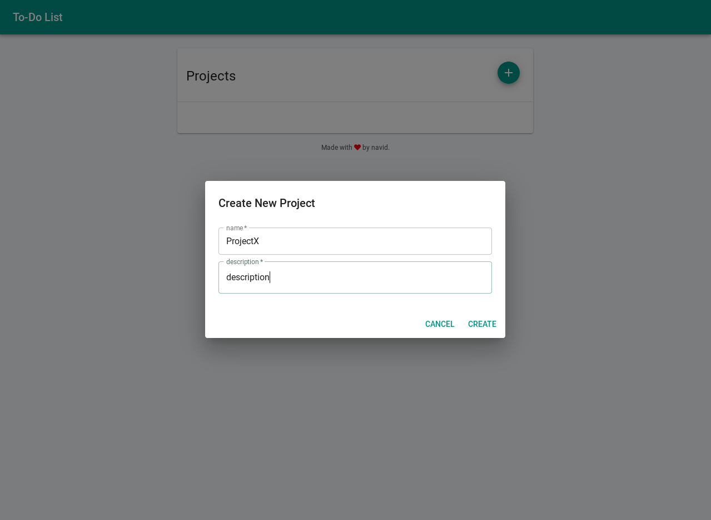
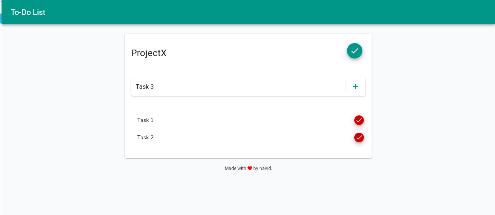

# laravel-react-todo
A simple todo app written in php using [Laravel](https://laravel.com) and [ReactJS](https://reactjs.org).

# Getting Started
Clone the project by running the command below:

`git clone https://github.com/nabidam/laravel-react-todo.git`

then run:

`composer install`

`npm install`

rename `.env.example` to `.env`
then run:

`php artisan key:generate`

then fill your database details in your .env file

now you can run migrations:

`php artisan migrate`

then start the application:

`php artisan serve`

and visit http://localhost:8000 to see the application.

# Built with
* [Laravel](https://laravel.com)
* [ReactJS](https://reactjs.org)
* [Material UI](https://material-ui.com)
* [Font Awesome](https://fontawesome.com)

# Thanks to
I used [Taskman](https://github.com/ammezie/tasksman)'s codes to write this app, their functionality are similar, but they just differ in UI.

# Screenshots

